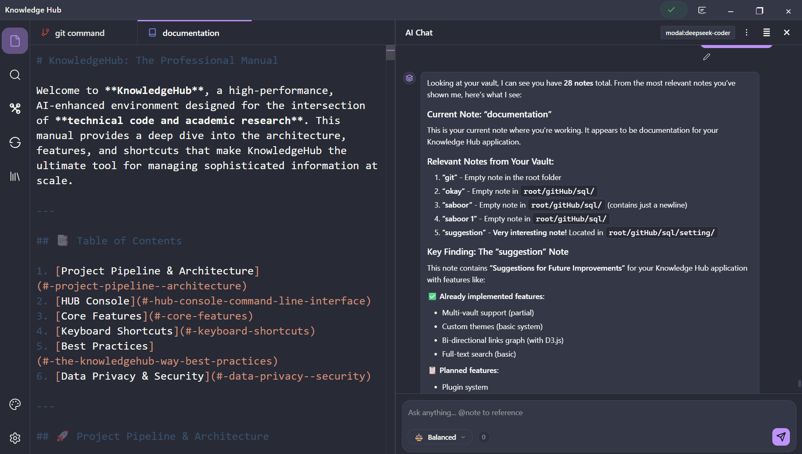

<div align="center">
  

# 🧠 Knowledge Hub

### The Professional Personal Knowledge Management (PKM) Environment

**High-Performance. AI-Enhanced. Multi-Provider.**

[](https://www.typescriptlang.org/)
[](https://www.electronjs.org/)
[](https://vitejs.dev/)

</div>

---

## 🚀 Overview

**Knowledge Hub** is a sophisticated, AI-driven environment designed for the intersection of technical code and academic research. It provides a seamless, high-performance interface for managing complex information at scale, powered by state-of-the-art AI engines.

Whether you are a developer organizing documentation or a researcher connecting disparate notes, Knowledge Hub provides the tools to transform a "vault" of files into an actionable, intelligent knowledge base.

## ✨ Key Features

- **🤖 Intelligent AI Assistant**: Integrated chat interface supporting industry-leading providers:
  - **DeepSeek** (Optimized for Chat & Coding)
  - **OpenAI** (GPT-4o, GPT-4o-mini)
  - **Anthropic Claude** (Sonnet 3.5, Opus)
  - **Ollama** (Local LLM support: Llama3, Mistral, etc.)
  - **X.AI Grok**
- **🔍 Personal RAG (Retrieval-Augmented Generation)**: The AI doesn't just know the world; it knows _your_ notes. High-performance vector indexing ensures context-aware responses from your own knowledge base.
- **⚡ HUB Console**: A command-line inspired interface for rapid navigation and system control.
- **🗺️ Knowledge Graph**: (Beta) Bi-directional link visualization to see how your notes connect across the vault.
- **🎨 Industrial Aesthetic**: A clean, monolithic UI with a technical "glassmorphism" influence, optimized for focus and long-form research sessions.
- **🔒 Privacy First**: Local storage, optional local AI (via Ollama), and secure API key management ensure your data remains yours.

## 🛠️ Tech Stack

- **Core**: Electron, TypeScript, Node.js
- **Frontend**: Vanilla JavaScript (ES Module based), CSS3 (Modern Industrial UI)
- **Build System**: Electron-Vite
- **AI Integration**: Custom provider architecture (OpenAI-compatible)
- **Search & RAG**: Efficient vector DB integration for local indexing

## 🚦 Getting Started

### Prerequisites

- [Node.js](https://nodejs.org/) (Latest LTS)
- [npm](https://www.npmjs.com/)

### Installation

1. **Clone the repository**

   ```bash
   git clone https://github.com/Saboor-Hamedi/knowledge-hub.git
   cd knowledge-hub
   ```

2. **Install dependencies**

   ```bash
   npm install
   ```

3. **Launch in development mode**
   ```bash
   npm run dev
   ```

### 📦 Building for Production

Build optimized installers for your platform:

```bash
# Windows
npm run build:win

# macOS
npm run build:mac

# Linux
npm run build:linux
```

## ⌨️ Power Shortcuts

| Action               | Shortcut           |
| :------------------- | :----------------- |
| **Command Palette**  | `Ctrl + Shift + P` |
| **HUB Console**      | `Ctrl + J`         |
| **AI Configuration** | `Ctrl + Alt + S`   |
| **Reload Vault**     | `Ctrl + Shift + R` |
| **Search Vault**     | `Ctrl + F`         |

---

<div align="center">
  Built with ❤️ for the technical community.
</div>
